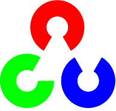

### Hey there!

I'm a Computer Vision and NLP Enthusiast. Most of my development revolves around implementing Deep Learning Techniques through Computer Vision.

Have a keen interest in developing Internet of Things based solutions for real life problems. Worked extensively on Arduinos, ESP Modules and Raspberry Pi to develop
projects.

I have a working knowledge of web development in HTML, CSS and PHP. Exploring Javascript, React and Tensorflow with JS.

Advanced Data Structures in Java with intermediate understanding of advanced Algorithms.

- 🔭 I’m currently working on ... OpenCV, Keras and Tensorflow 
- 💻 I’m currently learning ... NLP with BERT and Javascript
- 💬 Ask me about ... Computer Vision 
- 📫 How to reach me ... [E-mail](amolikvivian@gmail.com) or [LinkedIn Profile](https://linkedin.com/in/amolikvivian)
- 📝 What I write ... [Medium Profile](https://medium.com/amolikvivian)

 
<table>
<tbody>

<tr>
<td align="center" width="20%">
<b>
Java
</b> 

</td>

<td align="center" width="20%">
<b>
Python
</b> 

</td>

<td align="center" width="20%">
<b>
C++
</b>

</td>
</tr>

<tr>
<td align="center" width="20%">
<b>
HTML
</b> 
 
</td>

<td align="center" width="20%">
<b>
CSS
</b> 
 
</td>

<td align="center" width="20%">
<b>
Javascript
</b>

</td>
</tr>

<tr>
<td align="center" width="20%">
<b>
OpenCV
</b>

</td>

<td align="center" width="20%">
<b>
Tensorflow
</b> 
 
</td>

<td align="center" width="20%">
<b>
Keras  
</b> 
 
</td>
</tr>

<tr>
<td align="center" width="20%">
<b>
Arduino
</b>

</td>

<td align="center" width="20%">
<b>
Raspberry Pi
</b> 

</td>

<td align="center" width="20%">
<b>
Iot with AWS
</b> 

</td>
</tr>

</tbody>
</table
